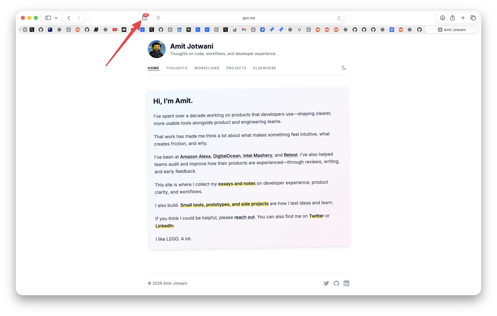

# Safari Tab Count

I have a tab problem. You probably do too.



This is a tiny Safari extension that shows the total number of tabs you have open. That's it. Just a number on the toolbar that updates in real-time.

Why? Because there's something deeply satisfying about watching that number go down as you close tabs. It's like a progress bar for getting your life together.

## What it does

- Shows total tab count across all Safari windows
- Updates instantly when you open/close tabs
- Judges you silently when you hit triple digits

## What it doesn't do

- Manage your tabs (that's your job)
- Show per-window breakdown (just the total)
- Work on iOS (macOS only)
- Fix the underlying problem of why you have 187 tabs open

## Installation

Not on the App Store. This is a "build it yourself" situation.

1. Clone this repo
2. Open `TabCount/TabCount.xcodeproj` in Xcode
3. Hit **Cmd + R** to build and run
4. In Safari:
   - **Safari → Settings → Advanced** → enable "Show Develop menu"
   - **Develop → Allow Unsigned Extensions**
   - **Safari → Settings → Extensions** → enable Tab Count
5. Right-click the toolbar → **Customize Toolbar** → drag Tab Count in

You'll need to re-enable unsigned extensions every time Safari restarts. Small price to pay for self-awareness.

## How it works

A service worker listens for tab events and recounts everything:

```javascript
browser.tabs.onCreated.addListener(() => updateTabCount());
browser.tabs.onRemoved.addListener(() => updateTabCount());
```

The badge might be empty when you first install — just open or close a tab to wake it up.

## License

MIT. Do whatever you want with it. Maybe you'll finally close some tabs.
